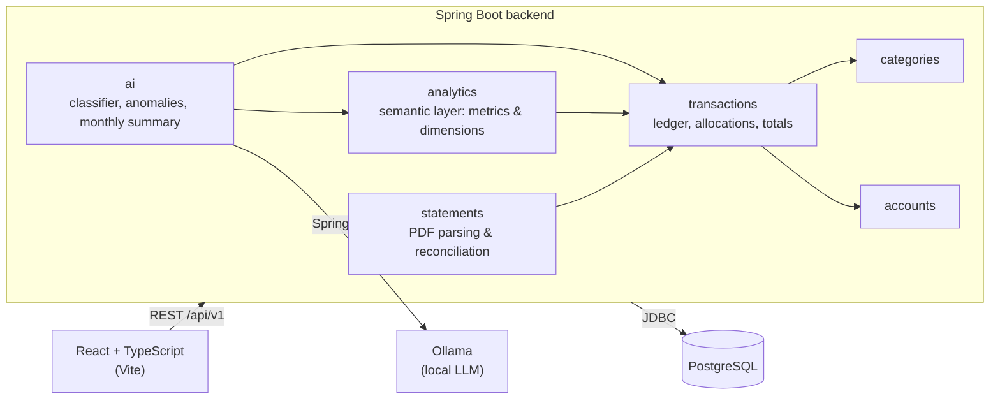
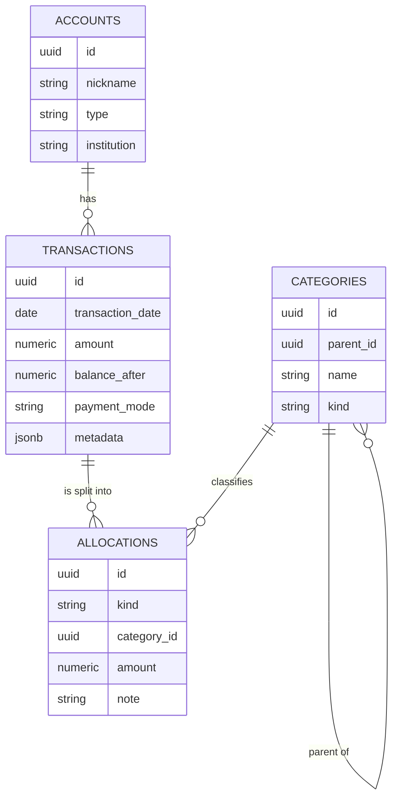

# Lekha

**AI-powered personal finance analytics for urban professionals in India.**

Lekha (लेखा, *"account"*) turns raw bank statements into an honest picture of where your money goes. It separates what
you actually *spent* from money that merely *moved*, classifies transactions for you, breaks your finances down on
interactive dashboards, flags anything unusual, and sums up each month in plain English.

> **AI suggests, the server verifies.** Language models are good at reading messy text and bad at arithmetic. In Lekha,
> AI proposes classifications, extracts meaning and explains results, but every rupee shown is computed by the server
> from exact, reconciled data.

<!-- Screenshots: add docs/screenshots/*.png here -->

---

## Why Lekha

Banking apps show you *cash flow*: money in and money out. That's not the same as spending.

| What happened | Cash flow says | Lekha says |
|---|---|---|
| You paid ₹2,000 for dinner and three friends owe you ₹1,500 | ₹2,000 spent | ₹500 on Dining out, ₹1,500 lent |
| You moved ₹50,000 to your own savings account | ₹50,000 out | Transfer, not spending |
| ₹10,000 SIP into a mutual fund | ₹10,000 out | Invested |
| Amazon refunded ₹799 | ₹799 in | Shopping spend reduced by ₹799 |

## Features

### Statement import
- Upload a bank statement PDF and Lekha reads every transaction from it.
- **Reconciled, never guessed.** Each import is checked against the statement's own debit/credit counts, totals and
  closing balance. If anything doesn't match, nothing is saved and you're told why.
- **Safe to re-import.** Uploading an overlapping or identical statement skips transactions already recorded, using a
  fingerprint of account, date, amount, balance and bank reference.
- Infers payment mode (UPI, NEFT, IMPS, card, ATM…) and keeps the original narration for reference.

### True spending, not cash flow
- **Splits.** Divide any transaction into pieces: part expense, part lent, part transfer. The pieces must add up
  exactly to the bank amount, so totals always reconcile with the bank.
- **Five kinds of money movement:** Expense, Income, Transfer, Investment and Lent. Only real expenses count as spending.
- **Refunds** reduce spending in the original category instead of showing up as income.
- **Editable two-level categories** (Food → Ordering in, Travel → Autos & cabs…) seeded with an India-first set: rent,
  maintenance, cook & house help, UPI-heavy food delivery, metro, PPF/EPF, NPS and more.
### Dashboards
- **Headline totals** for spending, income, invested, lent, savings rate and unclassified, for any month or custom range.
- **Questions about your habits:** how much you spend on weekends versus weekdays, which day of the week costs the most,
  and whether money goes early in the month (just after payday) or late.
- **Breakdowns that drill down:** spending by category, then sub-category, then the individual transactions behind
  a number. You can also break it down by account or payment mode, and combine them (weekend food spending by card
  versus UPI).
- **Any granularity:** daily, weekly, monthly, quarterly or yearly trends, with empty periods shown as zero rather than
  skipped.
- Every figure is an exact server-side aggregate of your allocations, so dashboard totals always match the ledger.

### Semantic layer
Every dashboard is powered by one query endpoint over a small, fixed vocabulary of **metrics** and **dimensions**:

| Metrics | Dimensions |
|---|---|
| `spending`, `income`, `invested`, `lent`, `savings_rate`, `transaction_count`, `spend_count`, `average_spend` | Time: `day`, `week`, `month`, `quarter`, `year`<br/>Calendar: `day_of_week`, `day_type` (weekday / weekend), `month_of_year`, `month_phase` (early / mid / late)<br/>Money: `kind`, `category`, `subcategory`, `account`, `payment_mode` |

A question like *"How much did I spend on food at weekends this month?"* is one request:

```json
POST /api/v1/analytics/query
{
  "metrics": ["spending"],
  "filters": { "category": ["<food category id>"], "day_type": ["WEEKEND"] },
  "from": "2026-09-01",
  "to": "2026-09-30"
}
```

- **Safe by construction.** Each metric and dimension is a fixed SQL fragment defined on the server. The client only
  chooses names, and every value is a bound parameter, so no client-supplied SQL ever runs.
- **One definition of every number.** "Spending" means the same thing on every chart: expenses net of refunds,
  excluding transfers, money lent and investments.
- **Bounded.** At most three dimensions, one time grain, and a capped row count and date range, so no query can grow
  unbounded.

### AI features

#### Auto-classification
New transactions arrive with a suggested kind and category. You accept with one click or correct them.
- **Learned rules first.** Each correction teaches Lekha a merchant rule (`UPI-SWIGGY…` → Food › Ordering in), so the
  same merchant is classified instantly and deterministically next time.
- **LLM fallback.** Unfamiliar narrations go to a locally hosted language model, which picks from your actual category
  tree. The model can't invent categories, and suggestions are never saved without your confirmation.
- **Measured.** A labelled evaluation set of synthetic transactions tracks accuracy whenever prompts or models change.

#### Monthly AI summary
The dashboard opens with a short written summary of the month:
> *"You spent ₹8,200 more than in August, mostly on Ordering in (+₹5,100). Investments stayed steady at ₹25,000, and
> two unusual charges were flagged."*

The server first computes the facts (totals, the biggest changes by category, anomalies) and the model only turns them
into prose. Every figure is checked against the computed facts, so the summary can't contain a number the server didn't
produce.

#### Anomaly alerts
- **Unusual spends:** a transaction far above your normal for that category ("₹4,200 at a restaurant, about 3× your usual").
- **Duplicate charges:** the same merchant and amount charged twice in a short window.
- Each alert explains *why* it fired, and you can dismiss it so it doesn't come back.
- Baselines are robust statistics computed per category (median and median absolute deviation). The AI writes the
  explanation, not the judgement.

### Privacy by design
- **Your data stays on your machine.** The language model runs locally through [Ollama](https://ollama.com). No
  financial data is sent to a third-party AI service.
- **Data minimisation.** Prompts carry only what a task needs (narration text and your category names), never balances
  or account numbers.
- PDFs are parsed in memory and not stored.

---

## Architecture



### Design principles
- **Bank facts are immutable.** Imported transactions are never edited. Your interpretation of them lives in
  *allocations*, so re-classifying never corrupts the bank record.
- **Money is exact.** Amounts are `NUMERIC(14,2)` / `BigDecimal`, values with more than two decimals are rejected rather
  than rounded, and all totals are summed on the server.
- **Package by feature.** Each feature (`accounts`, `statements`, `transactions`, `categories`, `analytics`, `ai`) owns its data and
  exposes a small public API. Dependencies point one way and there are no cycles.
- **All-or-nothing writes.** Imports and classifications run in a single database transaction. Saving a split locks the
  transaction's row (`SELECT … FOR UPDATE`) so simultaneous edits can't interleave.
- **Errors you can act on.** Every failure is an RFC 9457 `ProblemDetail` with a human-readable message, such as
  *"Allocations add up to -1800.00 but the transaction is -2000.00"*.

### Data model



---

## Tech stack

| Layer | Technology |
|---|---|
| Backend | Java 25, Spring Boot 4, Spring JDBC (`JdbcClient`), Flyway, Apache PDFBox |
| AI | Spring AI, Ollama (local LLM), structured output |
| Database | PostgreSQL 18 |
| Frontend | React 19, TypeScript (strict), Vite, React Router |
| Testing | JUnit 5, AssertJ, Mockito, Testcontainers (real PostgreSQL), MockMvc |
| Tooling | Gradle (Kotlin DSL), Docker Compose |

## API overview

| Method | Endpoint | Purpose |
|---|---|---|
| `GET` / `POST` | `/api/v1/accounts` | List and add accounts |
| `POST` | `/api/v1/accounts/{id}/statements` | Import a statement PDF (multipart) |
| `GET` | `/api/v1/transactions?from=&to=&accountId=` | Transactions with allocations and totals |
| `PUT` | `/api/v1/transactions/{id}/allocations` | Classify or split a transaction (replaces the whole set) |
| `GET` | `/api/v1/transactions/{id}/suggestion` | AI classification suggestion |
| `GET` / `POST` / `PATCH` / `DELETE` | `/api/v1/categories` | Manage the category tree |
| `POST` | `/api/v1/analytics/query` | Any metrics grouped and filtered by any dimensions (the semantic layer) |
| `GET` | `/api/v1/insights/anomalies` | Anomaly alerts for a period |
| `GET` | `/api/v1/insights/summary?month=` | AI-written summary of a month |

---

## Getting started

### Prerequisites
- Java 25, Node.js 22+, Docker
- [Ollama](https://ollama.com) for the AI features

### 1. Environment

```bash
cp .env.example .env          # then set LEKHA_DB_PASSWORD
source ./dev-env.sh           # project-scoped JDK, Gradle and npm settings; touches no global config
```

### 2. Database

```bash
docker compose up -d          # PostgreSQL on 127.0.0.1:15432
```

### 3. Local model

```bash
ollama pull <model>           # any instruction-tuned model, configured in application.yml
```

### 4. Backend

```bash
cd backend
./gradlew bootRun             # http://localhost:8080, Flyway migrates the schema on startup
```

### 5. Frontend

```bash
cd frontend
npm install
npm run dev                   # http://localhost:5173, /api is proxied to the backend
```

## Testing

```bash
cd backend && ./gradlew test
```

Repository and service tests run against a real PostgreSQL in Docker via Testcontainers, so SQL, constraints and
transactions behave exactly as in production. All test data is synthetic: real statements never enter the repository.

## Project structure

```
lekha/
├── backend/src/main/java/com/lekha/
│   ├── accounts/       accounts and their public lookup API
│   ├── statements/     PDF parsing, reconciliation, import
│   ├── transactions/   ledger, allocations, classification, totals
│   ├── categories/     editable category tree
│   ├── analytics/      semantic layer: metrics, dimensions, query compiler
│   ├── ai/             classifier, anomaly detection, monthly summary
│   └── web/            global error handling
├── backend/src/main/resources/db/migration/   Flyway migrations
├── frontend/src/
│   ├── api/            typed API client, one module per resource
│   ├── features/       accounts, statements, transactions, dashboard, insights
│   └── components/     shared UI
└── compose.yaml        local PostgreSQL
```

## Supported banks

| Bank | Account type | Status |
|---|---|---|
| HDFC Bank | Savings | Supported |

Parsers are pluggable (`StatementParser`), and each new bank is a self-contained parser with its own reconciliation.

## Roadmap
- Ask questions in plain English, answered by LLM tool calling over read-only queries
- More banks and credit card statements
- Pairing internal transfers across your own accounts automatically
- Splitwise integration and per-person lent balances
- Budgets and month-end spending forecasts
- Mobile app
